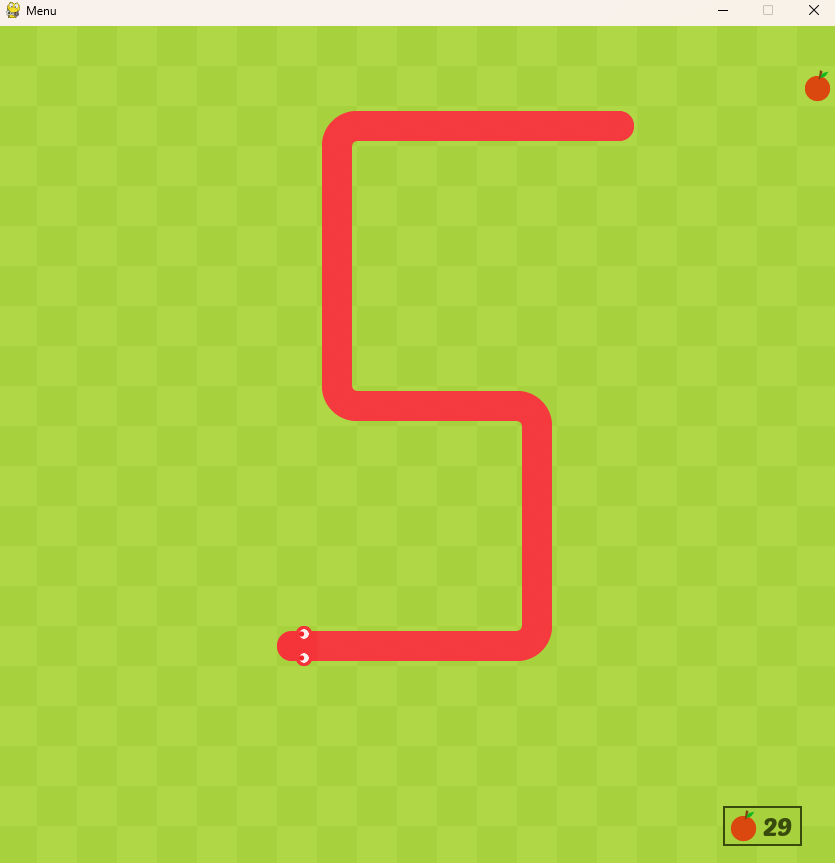
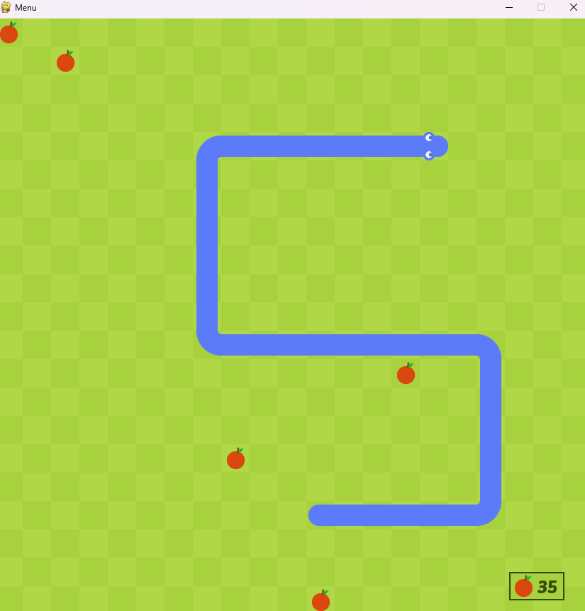

# Snake game
A recreation of the Google snake game using pygame

## Requirements
* Python 
* Pygame

## Established game modes.
### Classic game mode.

### Two snakes
Another snake will be shown on the screen, which will go in the opposite direction of the original snake.

## Modifiers
* Amount of fruits on screen. It can be 1,3 or 5
* 

The original idea comes from a [YouTube channel](https://www.youtube.com/watch?v=QFvqStqPCRU). But I wanted to implement some changes to make it more similar to the original game.
