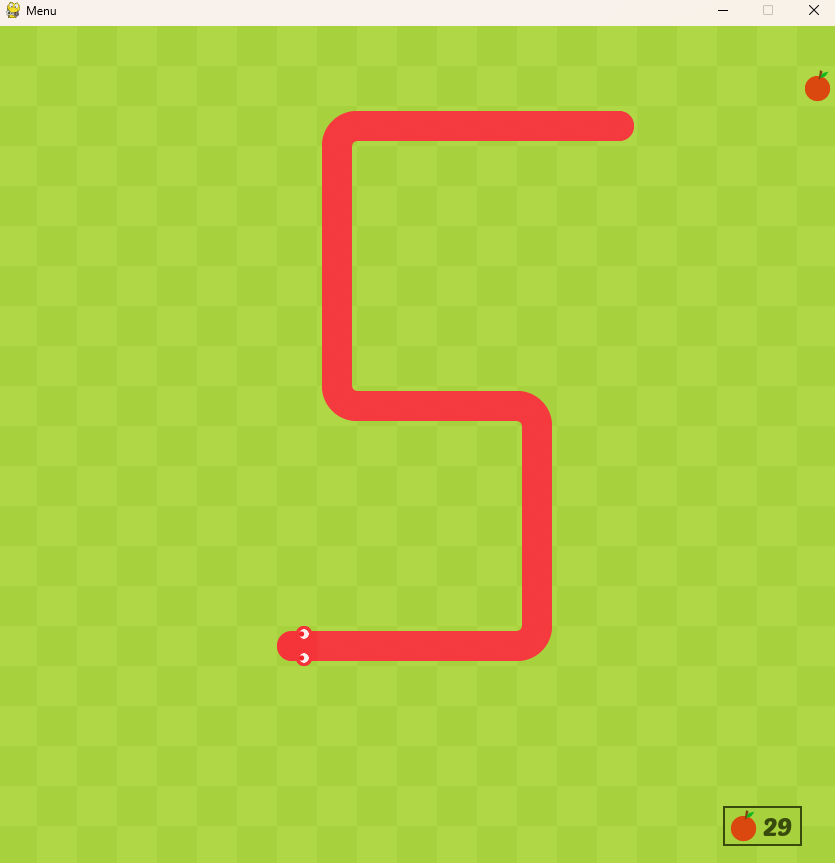
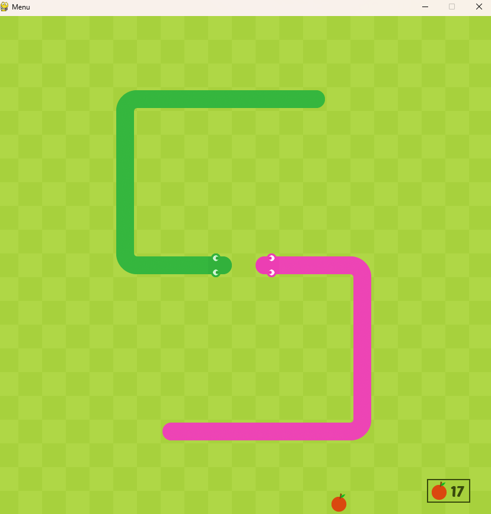
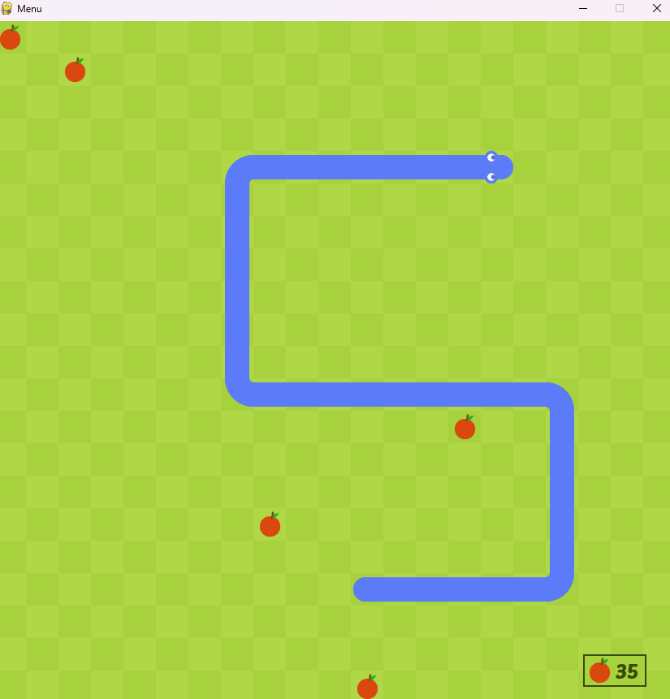

# Snake game
A recreation of the Google snake game using pygame

## Requirements
* Python 
* Pygame

## Established game modes
### Classic game mode

### Two snakes

## Modifiers
* Amount of fruits on screen. It can be 1,3 or 5

The original idea comes from a [YouTube channel](https://www.youtube.com/watch?v=QFvqStqPCRU). But I wanted to implement some changes to make it more similar to the original game.
